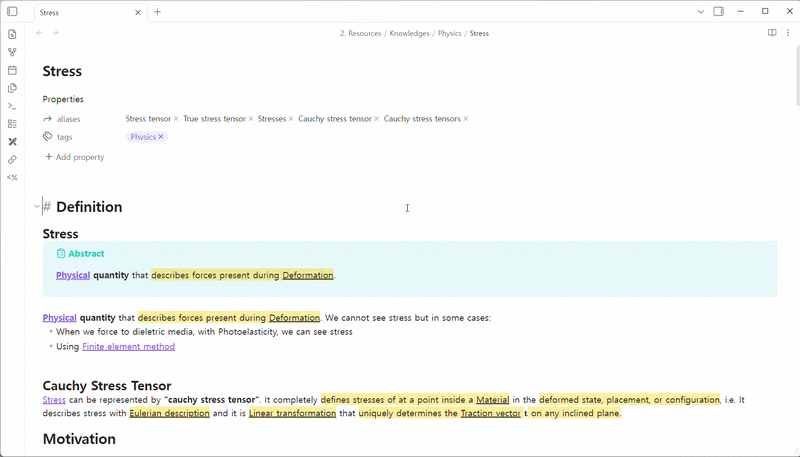
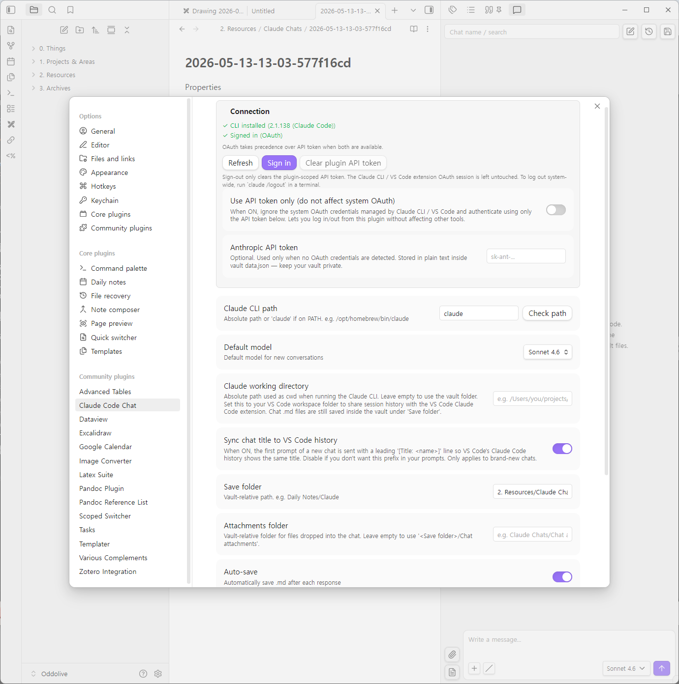
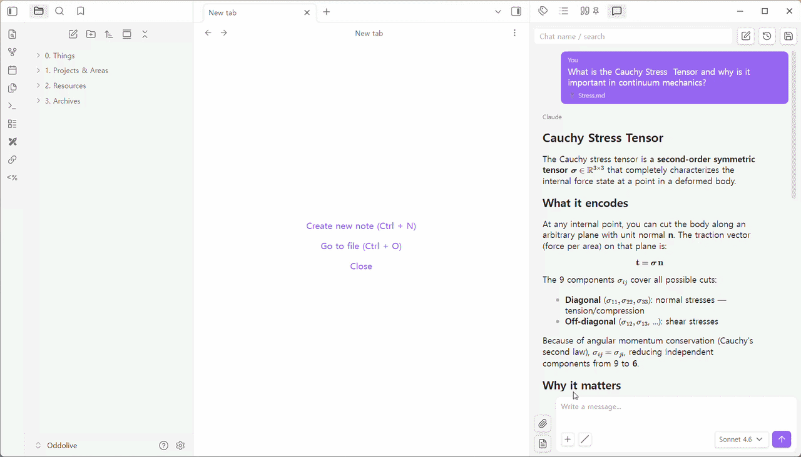
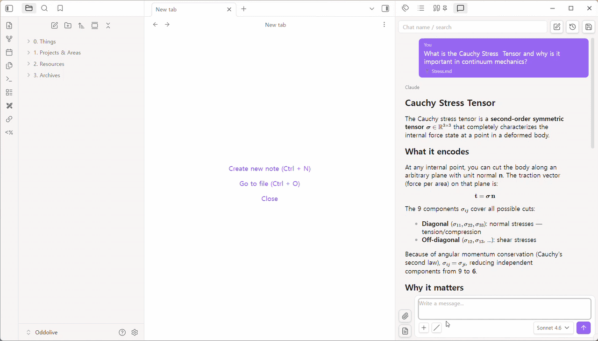
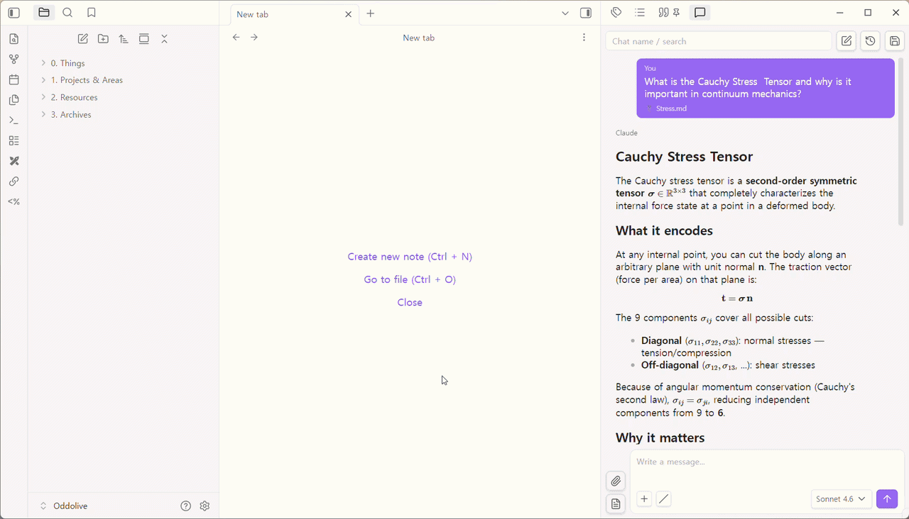
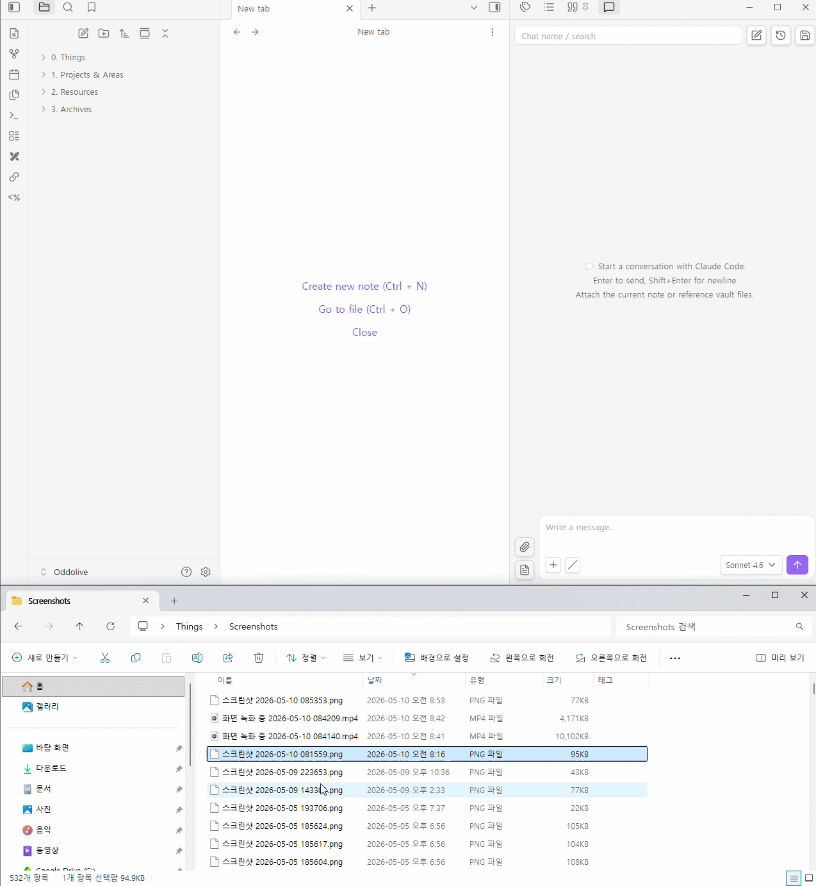
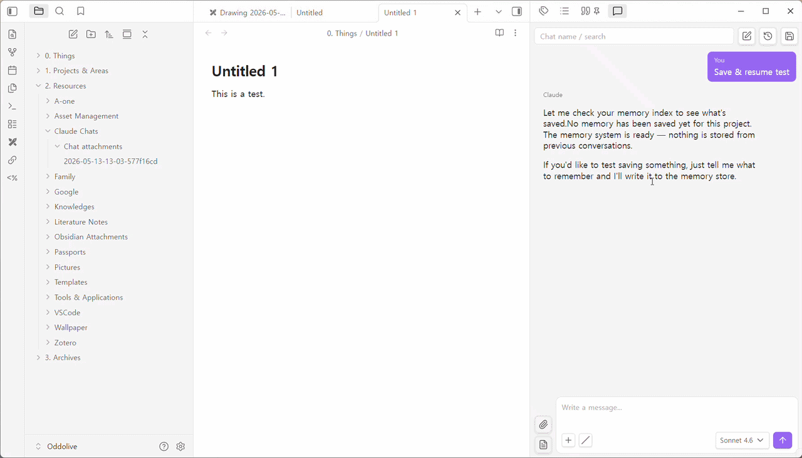
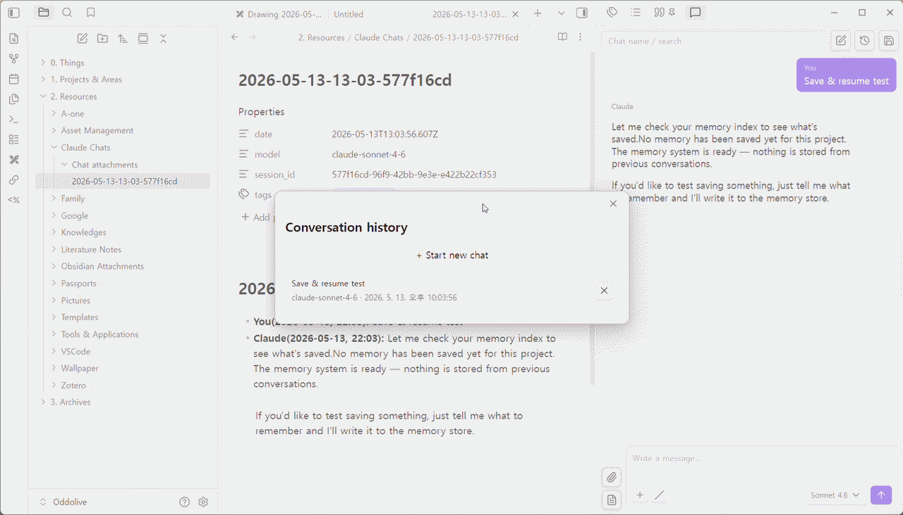
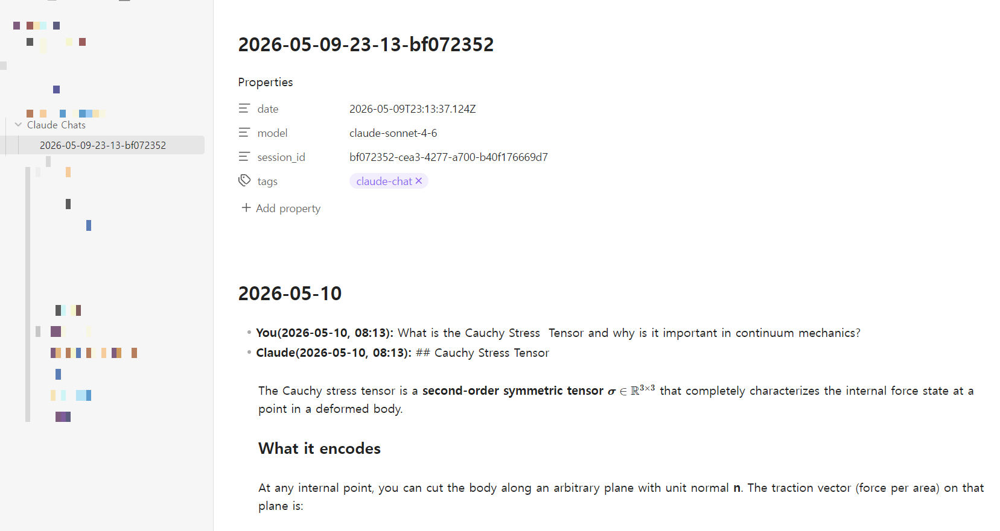

# Claude Code Chat for Obsidian

Chat with the [Claude Code CLI](https://docs.anthropic.com/en/docs/claude-code) from an Obsidian side panel — without leaving your notes.

OAuth or API key, session resume, file attachments, Markdown export, and a chat history you can search and reopen. Designed to share sessions with the VS Code Claude Code extension when you want to.

> If this plugin helps you, you can support its development on Ko-fi. Thanks!
>
> 

---

## Features

- **Streaming side-panel chat** powered by the Claude Code CLI.
- **Two auth modes**: OAuth (shared with Claude CLI / VS Code) or a plugin-scoped API token. OAuth takes priority unless you opt into "API token only".
- **Sessions**: continue the last chat or resume any previous one. Full transcript is restored when you reopen.
- **Markdown export**: save chats as `.md` files in your vault — date-grouped bullets, in-place rename when you change the title.
- **Searchable chat history** in the side panel header.
- **File attachments**: paperclip / file-picker buttons, drag & drop, multi-file, with a 50 MB per-file cap. Large text files auto-fall back to path references to stay under the OS command-line limit.
- **Slash command popup** with arrow-key navigation.
- **Hotkeys** for new chat and save.
- **i18n**: English by default, Korean when Obsidian language is set to `ko`.
- **VS Code session sharing**: set a working directory and the same chat appears in `/resume` on the CLI / VS Code extension.

---

## Requirements

- Obsidian 1.4.0 or newer (desktop only — uses `child_process`).
- [Claude Code CLI](https://docs.anthropic.com/en/docs/claude-code) installed and on your PATH.
- A Claude Pro / Max subscription (for OAuth) **or** an Anthropic API key.

---

## Installation

### Community Plugins (coming soon)
Once accepted into the Obsidian Community Plugins directory:
Settings → Community plugins → Browse → search **"Claude Code Chat"** → Install → Enable.

### BRAT (recommended while in beta)
1. Install the [BRAT](https://github.com/TfTHacker/obsidian42-brat) plugin.
2. BRAT → Add Beta plugin → `ODDOLIVE/obsidian-claude-code-chat`.
3. Enable Claude Code Chat in Community plugins.

### Manual
1. Download `main.js`, `manifest.json`, and `styles.css` from the [latest release](https://github.com/ODDOLIVE/obsidian-claude-code-chat/releases).
2. Copy them all into `<vault>/.obsidian/plugins/obsidian-claude-code-chat/`.
3. Reload Obsidian → enable the plugin.

---

## Authentication

Open Settings → Claude Code Chat → **Connection** card.

- **OAuth (default)**: if you have signed in with Claude CLI or the VS Code extension, this plugin picks up the same credentials automatically.
- **API token**: paste an Anthropic API key. Used as a fallback when OAuth credentials are not found.
- **API token only**: toggle this to ignore OAuth and force the plugin to use your API token, even when OAuth credentials exist.

Priority: **OAuth > API token**, unless "API token only" is on.

> ⚠️ The API token is stored in your vault's `data.json` in plaintext. If you sync your vault with other devices or share it, treat the API token as exposed.

---

## Usage

### Sending a message
Type, press Enter. Shift+Enter inserts a newline. Click the model dropdown bottom-right to switch between models mid-chat.

### Slash commands and menu
Type `/` in the input or click the slash button to open the inline command popup. Use arrow keys to navigate.

### Attaching files
Three ways:

1. **Paperclip / file-text buttons** — pick a file from your vault.

   

2. **Multi-file** — attach several at once.

   

3. **Drag & drop** — drop files (any type, up to 50 MB each) onto the chat panel. Non-vault files are copied into your configured attachments folder.

Text files are inlined into the prompt. Binary / image / oversized text files are referenced by path so Claude can load them via its Read tool.

### Save & resume
Save the current chat as a Markdown file in your save folder. The filename input doubles as a search box for previously saved chats — pick one to resume the full transcript.

### Chat history
The history icon in the header opens a list of all past sessions, with search, individual delete (×), and "Clear all".

### Saved file structure
Chats are exported as date-grouped Markdown bullets, easy to read and grep:

---

## Hotkeys

| Action | Shortcut |
|---|---|
| New chat | `Cmd/Ctrl + Shift + N` |
| Save chat | `Cmd/Ctrl + Shift + S` |

Customize them in Settings → Hotkeys.

---

## Settings overview

| Setting | What it does |
|---|---|
| Claude path | Path to the `claude` CLI binary (auto-detected on most systems). |
| Default model | Model used for new chats. |
| Working directory | Override the CLI's `cwd`. Set this to a folder shared with the VS Code Claude Code extension to see the same sessions on `/resume`. |
| Save folder | Where exported `.md` chats are stored. |
| Attachments folder | Where drag-and-dropped files are copied. Defaults to `<saveFolder>/Chat attachments`. |
| Auto save | Auto-save the chat after each response. |
| Title sync | Prefix the first prompt with `[Title: ...]` so the CLI's own history reflects your custom name. |
| API token | Anthropic API key (plaintext in `data.json`). |
| API token only | Force the API token path, even when OAuth credentials are available. |

---

## Working directory tip — sharing sessions with VS Code

Claude Code groups sessions by working directory. If you want the same chats to appear in the VS Code extension's `/resume` list:

1. Pick a folder (or your vault root).
2. Set it as **Working directory** in both this plugin and the VS Code extension.

The plugin spawns `claude -p ...` with that `cwd`, so the underlying session store is shared.

---

## Privacy & security

- The API token (if you use one) is stored in your vault's `data.json` in plaintext. Be mindful when syncing your vault.
- Chat content is sent directly from the Claude Code CLI to Anthropic. This plugin does not proxy or log anything externally.
- Attachments and chat exports stay inside your vault.

---

## Contributing

Issues and PRs are welcome. See `.github/ISSUE_TEMPLATE/` once filed.

---

## License

[MIT](LICENSE).
