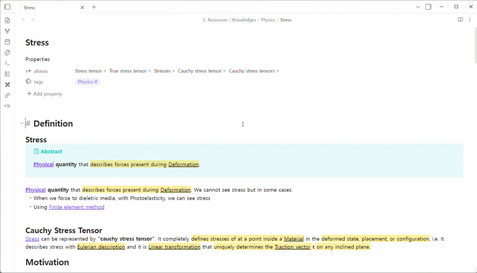
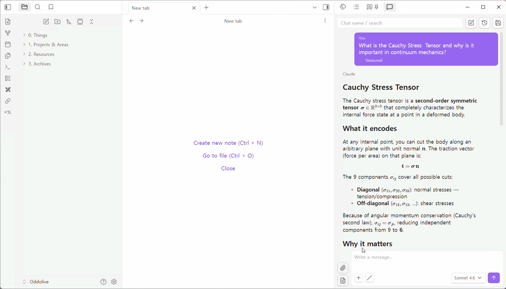
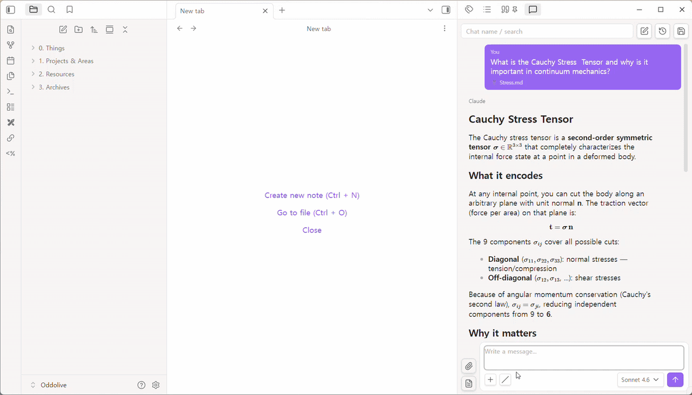
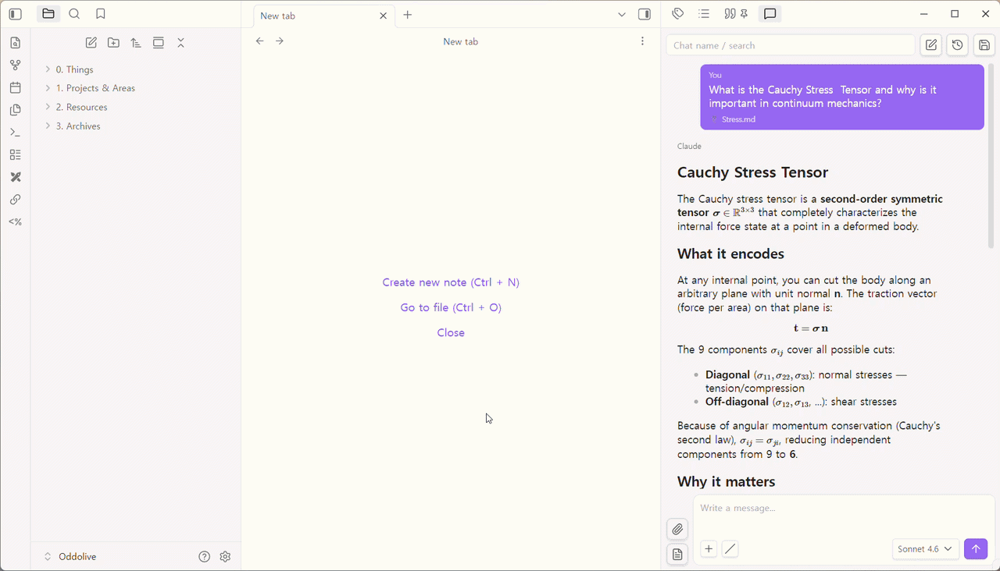
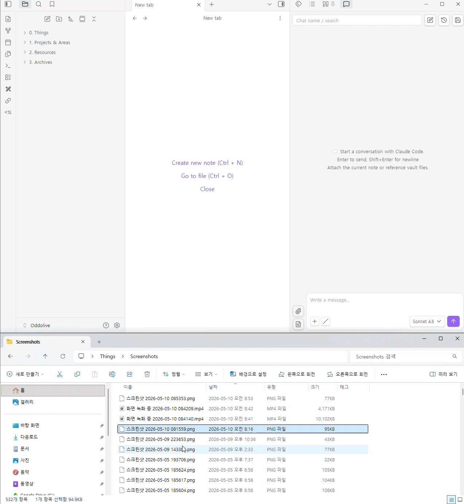
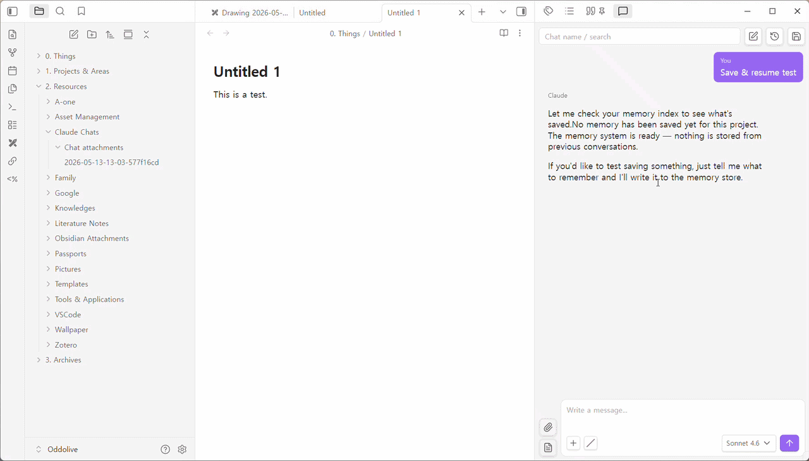
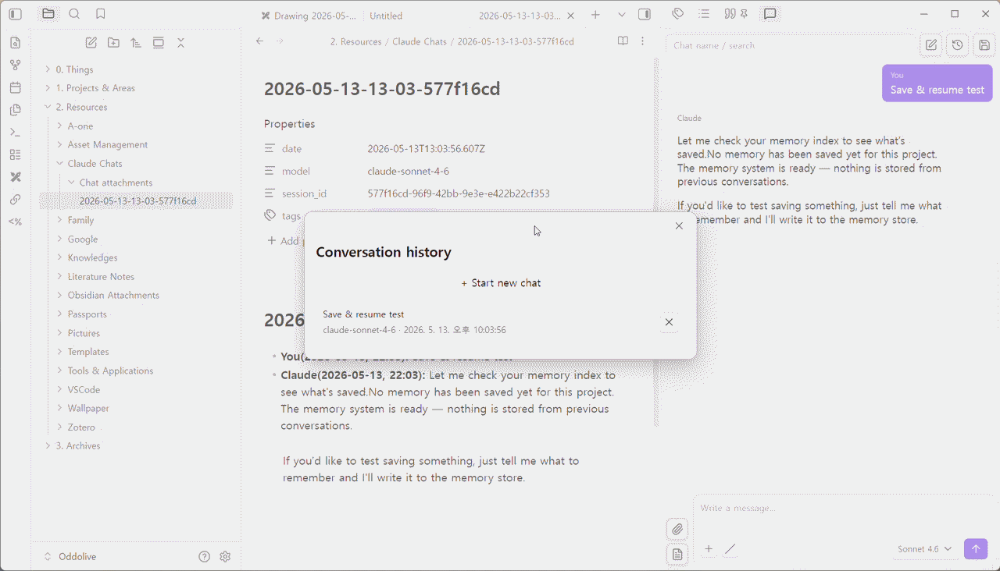
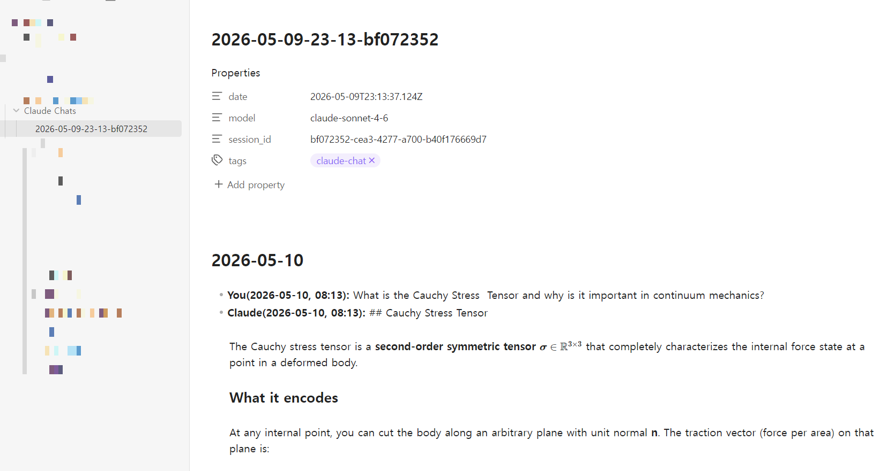

# Claude Code Chat for Obsidian

Chat with Claude, Codex, or Gemini from an Obsidian side panel — without leaving your notes. Multiple AI providers in one unified interface, with smart session continuity across PCs and models.

**Multi-provider**: Claude (Anthropic), Codex (OpenAI), Gemini (Google). OAuth or API key, session resume, file attachments, Markdown export, and searchable history. Share sessions with VS Code. Switch providers mid-conversation while keeping context.

If this plugin helps you, you can support its development on Ko-fi. Thanks!

---

## Features

### Multi-Provider Support
- **Claude (Anthropic)**: Primary provider with OAuth and API key auth.
- **Codex (OpenAI)**: ChatGPT account OAuth or API key auth.
- **Gemini (Google)**: OAuth or API key auth.
- **Provider switching**: Change providers mid-conversation (Claude → Codex → Gemini). Context is preserved via conversation replay.

### Chat & Sessions
- **Streaming side-panel chat** powered by Claude Code CLI (all providers).
- **Conversation continuity**: 
  - Same PC + provider: native native fast resumption.
  - Different PC or provider: automatic context injection keeps conversation context alive.
- **Multi-PC sync**: Use Google Drive to sync your vault; pick up any conversation on any PC and continue seamlessly.
- **Searchable history**: All sessions list in the side panel with search and individual delete.
- **Full transcript restore**: Session messages are saved in vault; full chat history restored when reopened.

### Authentication & Permissions
- **Three auth methods per provider**: OAuth (recommended, shared with CLI), API key (plugin-scoped), or API-key-only mode.
- **Permissions pre-allow** (optional): Set Claude CLI permission modes (`default`, `plan`, `acceptEdits`, `bypassPermissions`) and tool allow/deny lists in Settings to reduce permission prompts.
- Auth priority: OAuth > API key (toggle to force API key only).

### File & Markdown
- **File attachments**: paperclip / file-picker buttons, drag & drop, multi-file, with a 50 MB per-file cap. Large text files auto-fall back to path references to stay under the OS command-line limit.
- **Markdown export**: save chats as `.md` files in your vault — date-grouped bullets, in-place rename when you change the title.

### UI & Workflow
- **Slash command popup** with arrow-key navigation.
- **Hotkeys** for new chat and save.
- **Model selection**: Switch models per provider mid-chat via dropdown.
- **Clipboard image paste**: Paste screenshots directly from clipboard to attach images.
- **i18n**: English by default, Korean when Obsidian language is set to `ko`.

### VS Code Integration
- **Session sharing**: Set a working directory and the same chat appears in `/resume` on the CLI / VS Code extension.
- **Unified cwd**: Both plugin and VS Code extension see the same native sessions when pointing to the same folder.

---

## Requirements

- Obsidian 1.4.0 or newer (desktop only — uses `child_process`).
- **At least one of**:
  - [Claude Code CLI](https://docs.anthropic.com/en/docs/claude-code) (for Claude provider) + Claude Pro/Max subscription or Anthropic API key.
  - [Codex CLI](https://www.npmjs.com/package/@openai/codex) (for Codex/OpenAI) + ChatGPT account or OpenAI API key.
  - [Gemini CLI](https://www.npmjs.com/package/@google/generative-ai) (for Google Gemini) + Gemini account or Google API key.

All CLIs auto-detected on PATH or via Settings if not.

---

## Installation

### Community Plugins (coming soon)
Once accepted into the Obsidian Community Plugins directory:
Settings → Community plugins → Browse → search **"Claude Code Chat"** → Install → Enable.

### BRAT (recommended while in beta)
1. Install the [BRAT](https://github.com/TfTHacker/obsidian42-brat) plugin.
2. BRAT → Add Beta plugin → `ODDOLIVE/obsidian-claude-code-chat`.
3. Enable Claude Code Chat in Community plugins.

### Manual
1. Download `main.js`, `manifest.json`, and `styles.css` from the [latest release](https://github.com/ODDOLIVE/obsidian-claude-code-chat/releases).
2. Copy them all into `<vault>/.obsidian/plugins/claude-code-chat/`.
3. Reload Obsidian → enable the plugin.

---

## Authentication

Open Settings → Claude Code Chat → **Claude (Anthropic) Connection** / **Codex Connection** / **Gemini Connection** cards.

Each provider has its own auth settings:

### Claude (Anthropic)
- **OAuth (default)**: If you have signed in with Claude CLI or the VS Code extension, this plugin picks up the same credentials automatically.
- **API token**: Paste an Anthropic API key. Used as a fallback when OAuth credentials are not found.
- **API token only**: Toggle to ignore OAuth and force the API token, even when OAuth credentials exist.
- Priority: **OAuth > API token**, unless "API token only" is on.

### Codex (OpenAI)
- **Login session (default)**: Sign in with ChatGPT account (stored by Codex CLI).
- **API key**: OpenAI API key. Used as a fallback when login is not detected.
- **API key only**: Force API key, ignore ChatGPT login.
- Priority: **Login > API key**, unless "API key only" is on.

### Gemini (Google)
- **OAuth**: Google account sign-in via Gemini CLI.
- **API key**: Google Gemini API key.
- **API key only**: Force API key, ignore OAuth.
- Priority: **OAuth > API key**, unless "API key only" is on.

> ⚠️ API keys are stored in your vault's `data.json` in plaintext. If you sync your vault with other devices or share it, treat API keys as exposed. Use OAuth when possible.

---

## Usage

### Sending a message
Type, press Enter. Shift+Enter inserts a newline. Click the model dropdown bottom-right to switch between models mid-chat.

### Slash commands and menu
Type `/` in the input or click the slash button to open the inline command popup. Use arrow keys to navigate.

### Attaching files
Three ways:

1. **Paperclip / file-text buttons** — pick a file from your vault.

   

2. **Multi-file** — attach several at once.

   

3. **Drag & drop** — drop files (any type, up to 50 MB each) onto the chat panel. Non-vault files are copied into your configured attachments folder.

Text files are inlined into the prompt. Binary / image / oversized text files are referenced by path so Claude can load them via its Read tool.

### Save & resume
Save the current chat as a Markdown file in your save folder. The filename input doubles as a search box for previously saved chats — pick one to resume the full transcript.

### Chat history
The history icon in the header opens a list of all past sessions, with search, individual delete (×), and "Clear all".

### Saved file structure
Chats are exported as date-grouped Markdown bullets, easy to read and grep:

---

## Hotkeys

| Action | Shortcut |
|---|---|
| New chat | `Cmd/Ctrl + Shift + N` |
| Save chat | `Cmd/Ctrl + Shift + S` |

Customize them in Settings → Hotkeys.

---

## Settings Overview

### Connections

#### Claude (Anthropic) Connection
| Setting | What it does |
|---|---|
| Claude CLI path | Path to the `claude` CLI binary (auto-detected on most systems). |
| Default Claude model | Model used for new chats (Sonnet 4.6, Opus 4.6, Haiku 4.5). |
| Claude working directory | Override the CLI's `cwd`. Set to a folder shared with VS Code extension to see the same sessions on `/resume`. |
| API key | Anthropic API key (plaintext in `data.json`). |
| API key only | Force API key auth, ignore OAuth. |

#### Codex Connection
| Setting | What it does |
|---|---|
| Codex CLI path | Path to the `codex` CLI binary. |
| Default Codex model | Model for new chats (o4-mini, o3, or auto). |
| API key | OpenAI API key. |
| API key only | Force API key, ignore ChatGPT login. |

#### Gemini Connection
| Setting | What it does |
|---|---|
| Gemini CLI path | Path to the `gemini` CLI binary. |
| Default Gemini model | Model for new chats (Gemini 2.5 Pro, 2.5 Flash, 2.0 Flash, or auto). |
| API key | Google Gemini API key. |
| API key only | Force API key, ignore OAuth. |

### Permissions (Optional)
| Setting | What it does |
|---|---|
| Permission mode | `default` (prompt each tool), `plan` (show tools before running), `acceptEdits` (auto-allow Edit), `bypassPermissions` (auto-allow all). |
| Auto-allowed tools | Tool names or patterns to auto-allow (comma/newline-separated, e.g., `Read, Edit, Bash(git status)`). |
| Auto-blocked tools | Tool names or patterns to auto-block (e.g., `Bash(rm *)`, `Bash(git push *)`). |

### General Settings
| Setting | What it does |
|---|---|
| Default provider | Which AI provider to use for new chats (Claude, Codex, or Gemini). |
| Save folder | Where exported `.md` chats are stored. |
| Attachments folder | Where drag-and-dropped files are copied. Defaults to `<saveFolder>/Chat attachments`. |
| Auto save | Auto-save the chat after each response. |
| Title sync | Prefix the first prompt with `[Title: ...]` so the CLI's history reflects your custom name. |

---

## Multi-PC and Provider Continuity

### Same PC, same provider (fastest)
Native session resume via CLI flags. Full conversation ID and message history preserved.

### Different PC (same provider)
- Vault is synced via Google Drive (or other sync service).
- Open the same conversation on a different PC.
- Previous messages are injected as context in the new message.
- Works across any number of PCs.

### Provider switch (Claude ↔ Codex ↔ Gemini)
- Change provider mid-conversation via the provider button.
- Previous context is automatically injected as a preamble in the first new message.
- Each provider operates independently but sees the full conversation history.
- Useful for comparing responses or switching to a specialized model.

### Sharing sessions with VS Code

Claude Code groups sessions by working directory. If you want the same chats to appear in the VS Code extension's `/resume` list:

1. Pick a folder (or your vault root).
2. Set it as **Claude working directory** in this plugin AND the VS Code extension.

The plugin spawns the CLI with that `cwd`, so the underlying session store is shared.

---

## Privacy & security

- The API token (if you use one) is stored in your vault's `data.json` in plaintext. Be mindful when syncing your vault.
- Chat content is sent directly from the Claude Code CLI to Anthropic. This plugin does not proxy or log anything externally.
- Attachments and chat exports stay inside your vault.

---

## Contributing

Issues and PRs are welcome. See `.github/ISSUE_TEMPLATE/` once filed.

---

## License

[MIT](LICENSE).
